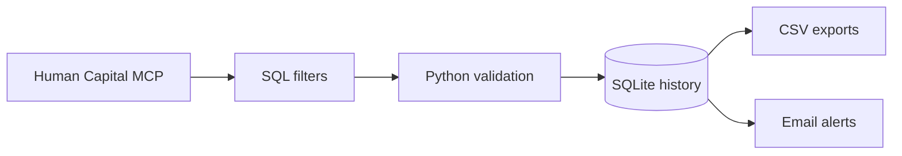

# Data Hygiene — Automated Job Vacancy Intelligence

A Windows-first Python workflow that converts Latvian vacancy data into a monitored, queryable job-market feed. It filters relevant roles, preserves change history, produces analysis-ready exports, and sends recipient-specific alerts without repeatedly sending the same vacancy.

This is a practical data-engineering and automation project built around a real business problem: reducing manual vacancy searches while maintaining an auditable history of what changed.

## What the system does

- Queries Latvia's Human Capital MCP data service over JSON-RPC/HTTPS
- Applies salary, location, recency, and multilingual keyword rules in SQL
- Validates response structure and protects CSV exports from formula injection
- Stores vacancy history and delivery state in SQLite
- Detects newly observed vacancies and changes to tracked fields
- Produces CSV outputs suitable for Excel or Power BI
- Generates HTML and plain-text email reports
- Schedules unattended Windows runs with locking, retries, and logs
- Protects local email credentials with Windows DPAPI

## Architecture



## Engineering decisions

| Concern | Implementation |
| --- | --- |
| Data quality | Type and schema checks, numeric validation, deduplication by vacancy ID |
| Change tracking | SQLite history plus field-level change records |
| Reliability | Atomic file writes, process locks, retry-aware scheduling, execution logs |
| Delivery control | Recipient-level state prevents repeat notifications |
| Security | Credentials stay outside Git; passwords are protected with Windows DPAPI |
| Reporting | Clean CSV outputs and formatted HTML summaries |

## Main outputs

| Output | Purpose |
| --- | --- |
| `vacancies_live.csv` | Current vacancies matching the configured rules |
| `vacancies_new.csv` | Vacancies first discovered during the current day |
| `vacancies_history.csv` | Auditable first-seen and last-seen history |
| `vacancies_changes.csv` | Field-level salary, deadline, and status changes |
| `vacancies_history.sqlite3` | Persistent local vacancy history |
| HTML email | Human-readable alert with links and vacancy details |

Generated data, logs, email configuration, credentials, and local databases are intentionally excluded from this public repository.

## Project structure

| File | Responsibility |
| --- | --- |
| `job_filter_mcp.py` | MCP client, SQL query construction, filters, and validation |
| `job_tracker.py` | History, comparison logic, SQLite storage, and CSV export |
| `vacancies_email.py` | Secure configuration, message rendering, and SMTP delivery |
| `job_tracker_email.py` | End-to-end refresh and email orchestration |
| `email_settings.py` | Local email settings interface |
| `install_job_schedule.ps1` | Windows Task Scheduler setup |
| `install_email_notifications.ps1` | Email notification setup |
| `README_email.md` | Detailed email configuration and troubleshooting |
| `job_tracker_README.md` | Detailed scheduling and history documentation |

## Quick start

Requirements: Python 3.10+, Windows for DPAPI and scheduled execution, and internet access.

```powershell
# Refresh the vacancy selection and history
uv run .\job_tracker.py

# Preview the email without sending
uv run .\job_tracker_email.py --preview

# Send one test message to the configured sender address
uv run .\job_tracker_email.py --test
```

The filtering rules—minimum salary, city, lookback period, and keywords—are configured in `job_filter_mcp.py`.

## Data source

Vacancy data is retrieved from the [Latvian Official Statistics Human Capital MCP service](https://mcp-hc.stat.gov.lv/). The source feed contains CV.lv vacancy snapshots. Data attribution follows [CC BY 4.0](https://creativecommons.org/licenses/by/4.0/).

## AI-assisted development

I built this project using AI-assisted development with Codex and ChatGPT. My role included defining the requirements and business rules, choosing the workflow, reviewing and iterating the code, validating query and export results, and checking privacy, failure handling, and usability.

AI accelerated implementation; responsibility for the problem definition, decisions, validation, and final output remained with me.

## Skills demonstrated

Python · SQL · JSON-RPC · MCP · SQLite · data validation · change detection · reporting automation · secure configuration · Windows Task Scheduler · Git/GitHub

## Next improvements

- Add automated unit and integration tests
- Package configuration separately from business logic
- Add a Power BI dashboard for vacancy trends and salary analysis
- Add a cross-platform scheduler and secrets backend
